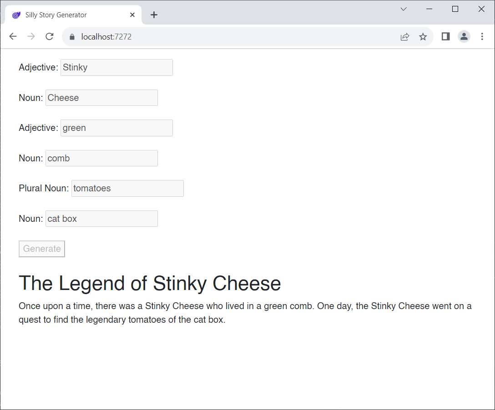

# Blazor Puzzle #8

## A Printing Puzzle

YouTube Video: https://youtu.be/M5sNRlq2R2s

BlazorPuzzle Home Page: https://blazorpuzzle.com

### The Challenge:

This is a silly story generator that puts together a little story from words provided by the user.

Now, we'd like to print the story, but we don't want the input UI to print. How can we achieve this?

