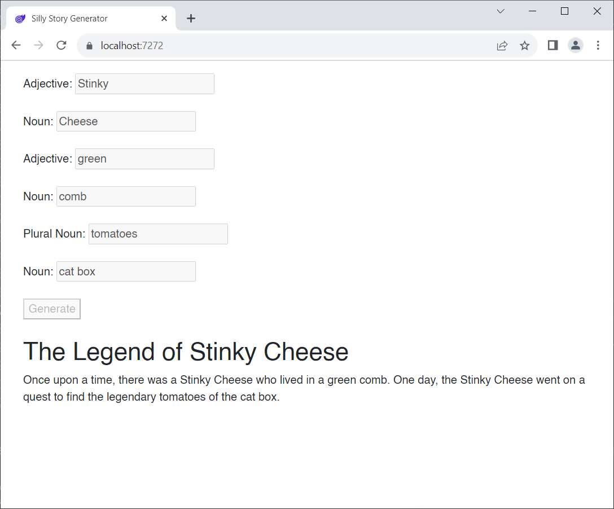

# Blazor Puzzle #8

## A Printing Puzzle

YouTube Video: https://youtu.be/M5sNRlq2R2s

BlazorPuzzle Home Page: https://blazorpuzzle.com

### The Challenge:

This is a silly story generator that puts together a little story from words provided by the user.



Now, we'd like to print the story, but we don't want the input UI to print. How can we achieve this?

### The Solution:

The solution has nothing to do with Blazor. It's a CSS issue.

There is a class built in to bootstrap that hides content from a printed form.

Just wrap whatever content you want to hide in a `div` with the class "d-print-none"

*Index.razor*:

```c#
@page "/"

<div class="d-print-none">

    <PageTitle>Silly Story Generator</PageTitle>

    <label>Adjective:</label>
    <input disabled="@disabled" @bind="Adj1" />
    <br />
    <br />

    <label>Noun:</label>
    <input disabled="@disabled" @bind="Noun1" />
    <br />
    <br />

    <label>Adjective:</label>
    <input disabled="@disabled" @bind="Adj2" />
    <br />
    <br />

    <label>Noun:</label>
    <input disabled="@disabled" @bind="Noun2" />
    <br />
    <br />

    <label>Plural Noun:</label>
    <input disabled="@disabled" @bind="PlNoun1" />
    <br />
    <br />

    <label>Noun:</label>
    <input disabled="@disabled" @bind="Noun3" />
    <br />
    <br />

    <button disabled="@disabled" @onclick="GenerateStory">Generate</button>
    <br />
    <br />
</div>

<h1>@Title</h1>
<p>@Story</p>

@code {

    bool disabled = false;
    string Title { get; set; } = string.Empty;
    string Story { get; set; } = string.Empty;
    string Noun1 { get; set; } = string.Empty;
    string Adj1 { get; set; } = string.Empty;
    string Noun2 { get; set; } = string.Empty;
    string Adj2 { get; set; } = string.Empty;
    string PlNoun1 { get; set; } = string.Empty;
    string Noun3 { get; set; } = string.Empty;


    void GenerateStory()
    {
        disabled = true;
        Title = $"The Legend of {Adj1} {Noun1}";
        Story = $"Once upon a time, there was a {Adj1} {Noun1} who lived in a {Adj2} {Noun2}.";
        Story += $" One day, the {Adj1} {Noun1} went on a quest to find the legendary {PlNoun1} of the {Noun3}.";
    }
}
```

Boom!
